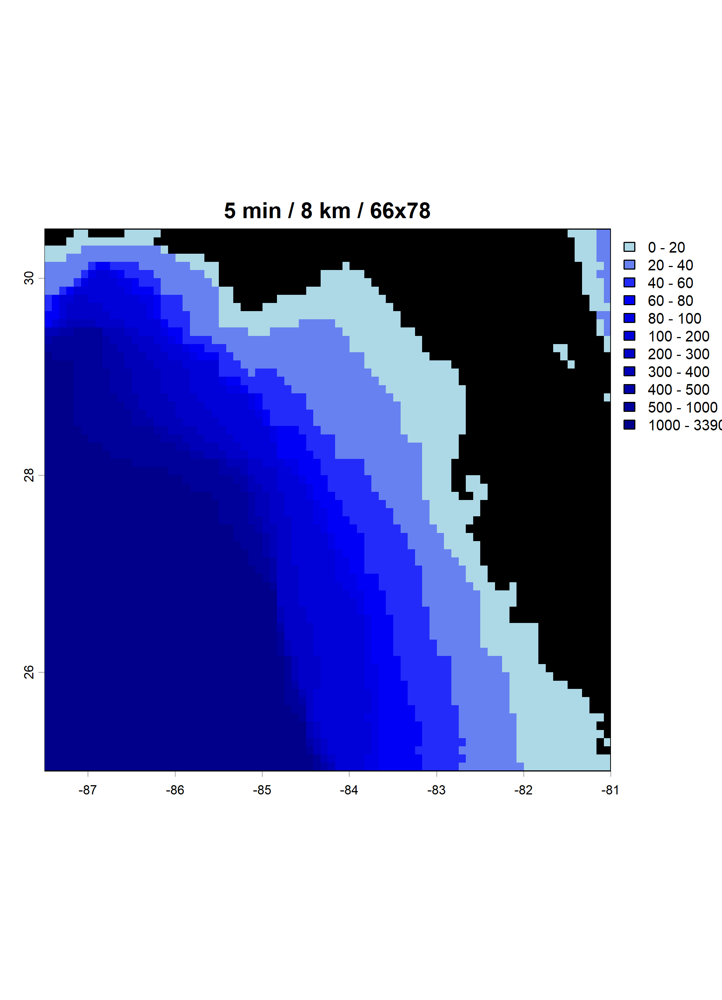
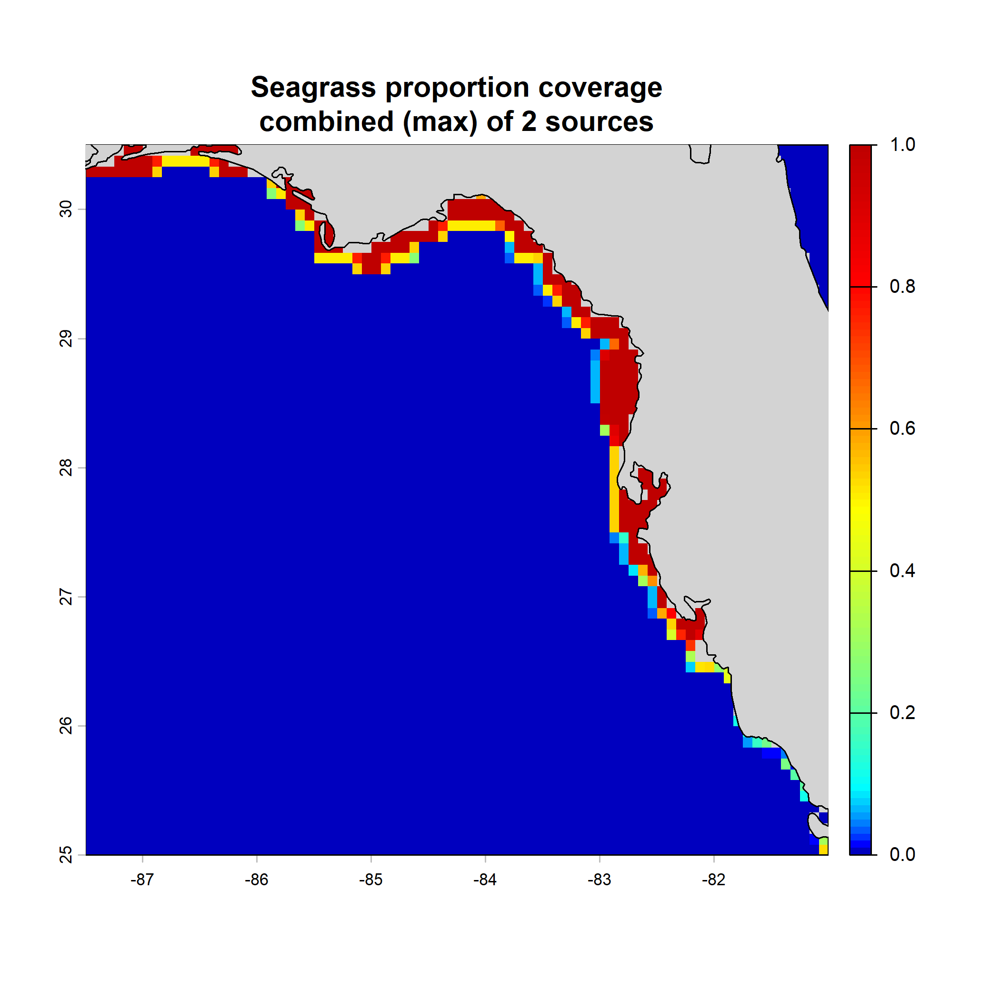
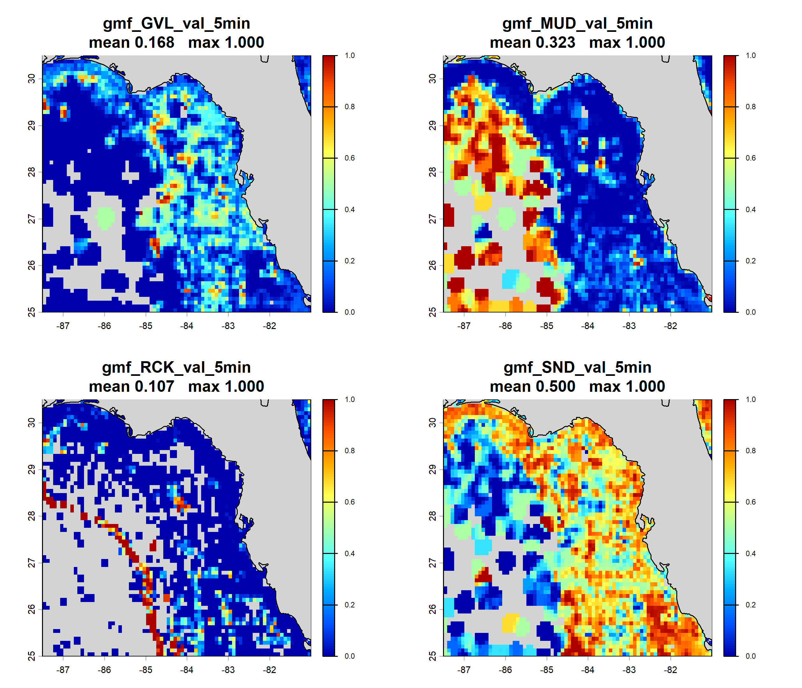
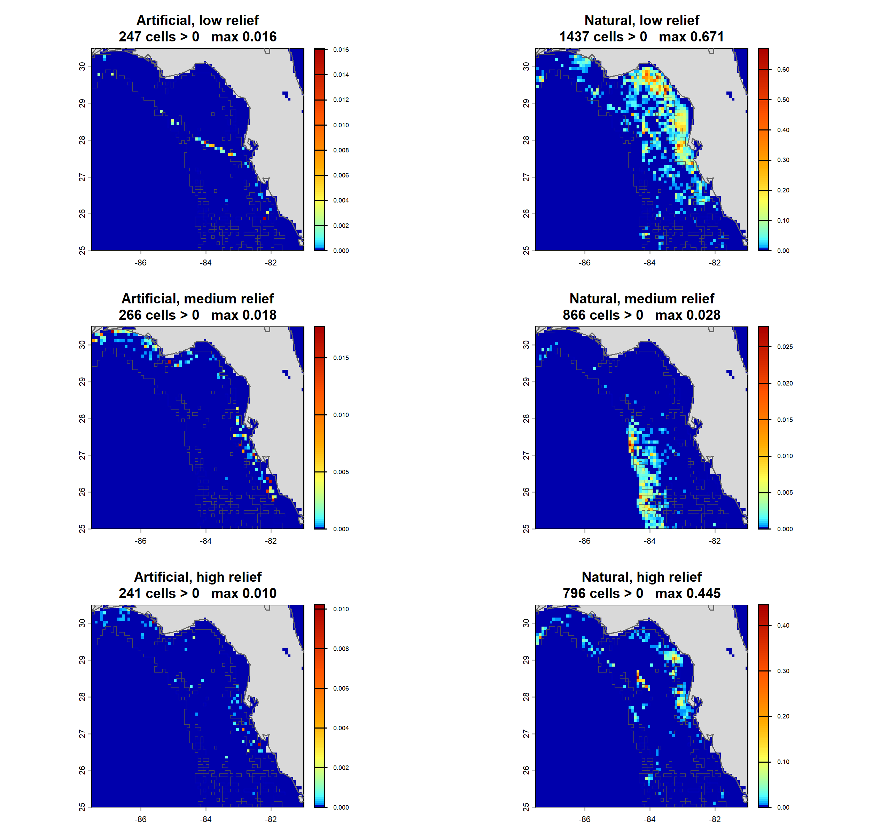
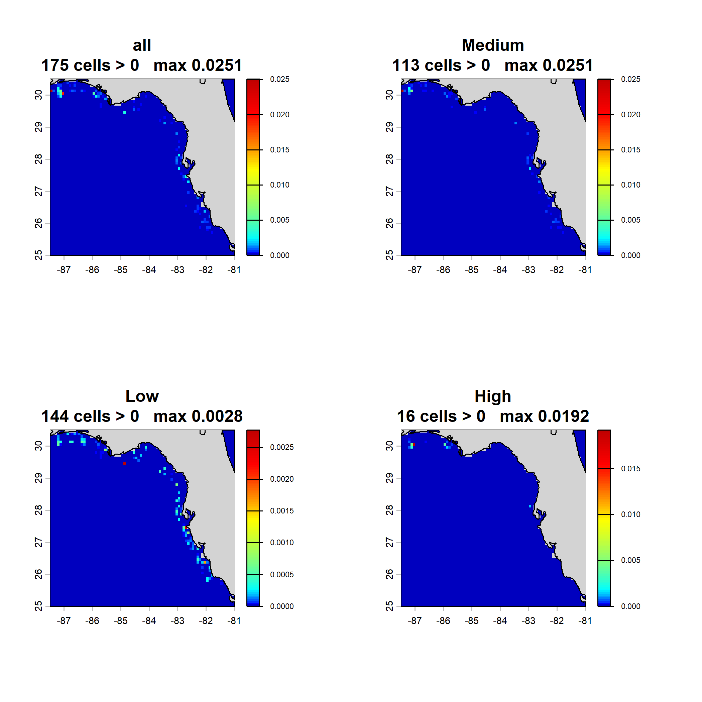
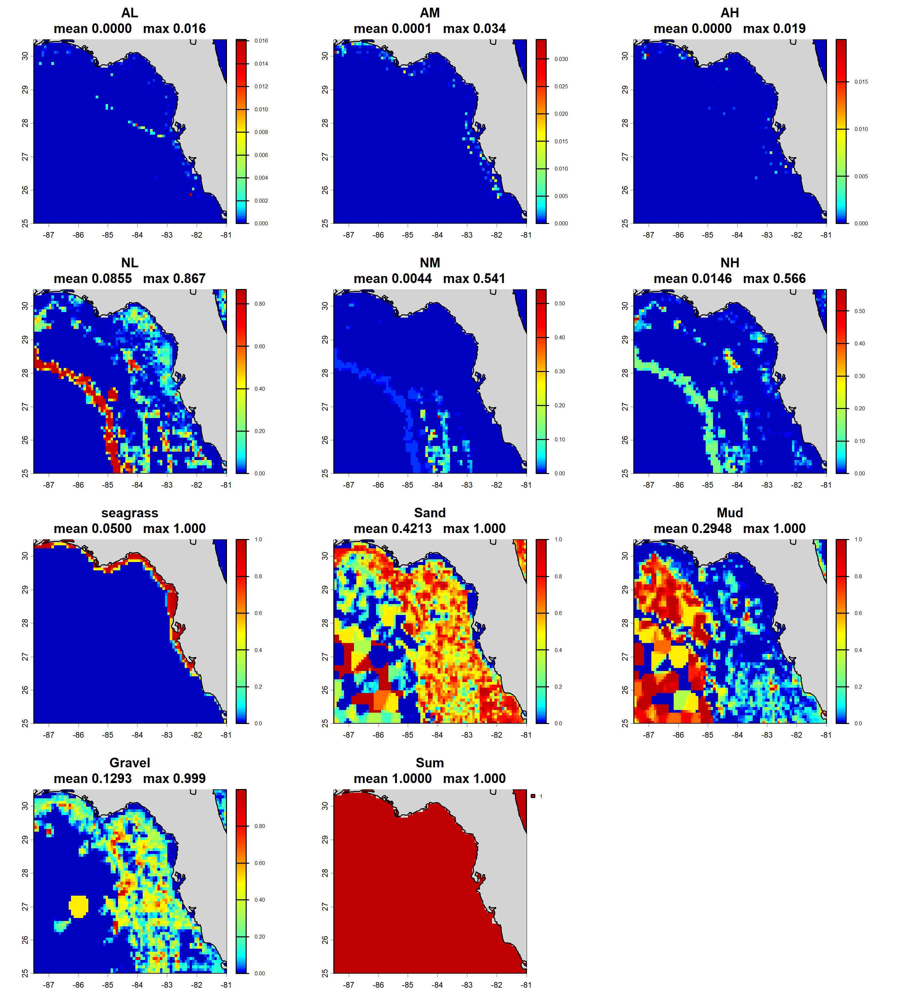
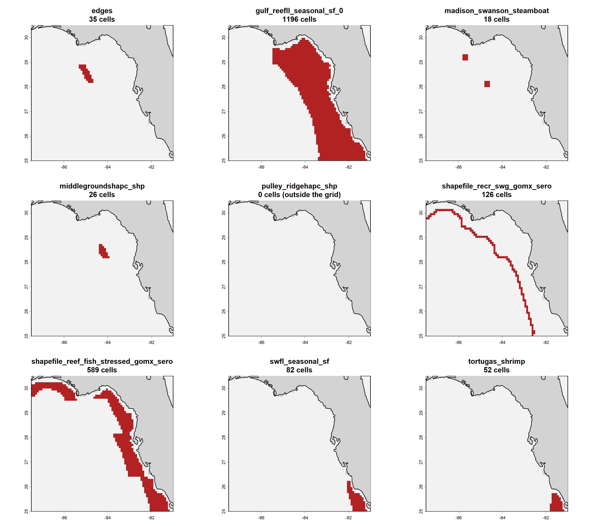
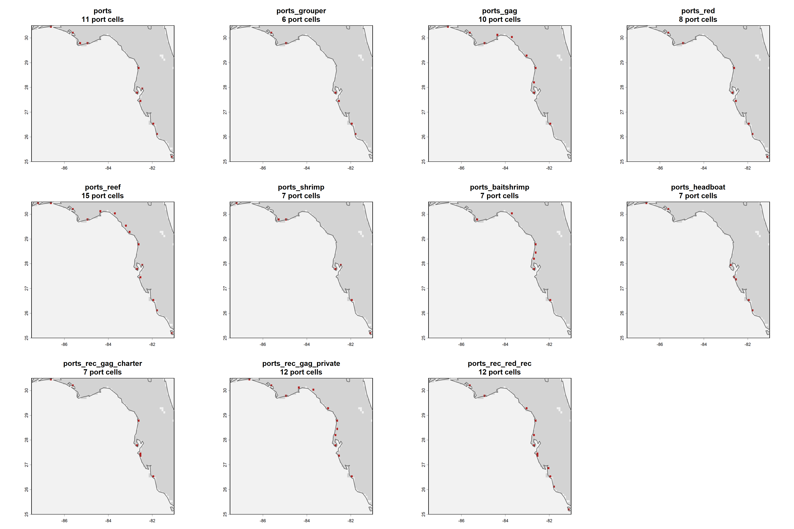
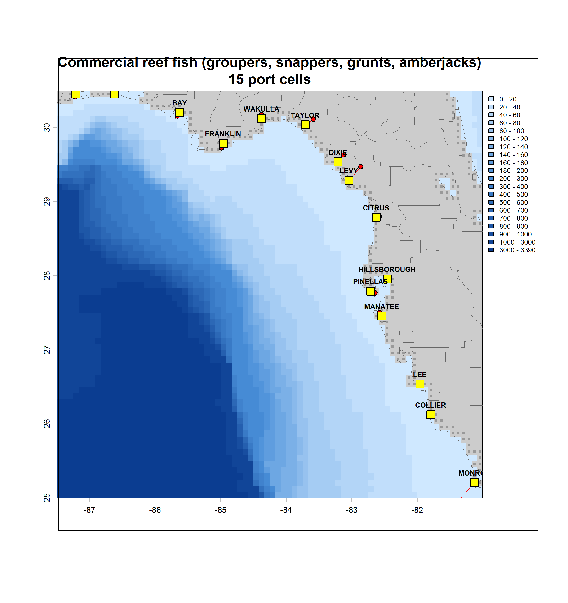
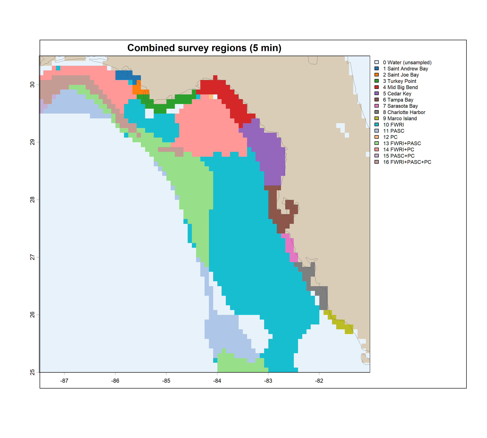

# EcospaceBasemap

Builds the **static basemap layers** for the West Florida Shelf Ecopath with
Ecosim (EwE) / Ecospace model: depth, habitat, management areas, fleet ports and
survey regions, all written as ESRI ASCII grids aligned to a common model grid.

This repository consolidates work that was previously spread across
`EnvironmentalDrivers2EwE`, `GFISHER`, and a collection of standalone scripts
under `Ecospace/maps`. Every module was ported to `terra`, verified against the
grids the legacy scripts produced, and reduced to callable functions driven from
a single control script.

Part of *Operationalizing the West Florida Shelf ecosystem model and application
to red tides, stock assessment, and catch advice for Gulf of Mexico reef fish*
(PI: David Chagaris).

---

## Contents

- [Quick start](#quick-start)
- [How it is organised](#how-it-is-organised)
- [Requirements](#requirements)
- [Input data](#input-data)
- [The driver script, section by section](#the-driver-script-section-by-section)
  - [1. Depth and exclusion](#1-depth-and-exclusion)
  - [2.1 Seagrass](#21-seagrass)
  - [2.2 dbSEABED substrate](#22-dbseabed-substrate)
  - [2.3 GFISHER reef habitat](#23-gfisher-reef-habitat)
  - [2.4 Artificial reefs](#24-artificial-reefs)
  - [2.5 Combine habitats to sum 1](#25-combine-habitats-to-sum-1)
  - [3. Management areas](#3-management-areas)
  - [4. Fleet ports](#4-fleet-ports)
  - [5. Survey regions](#5-survey-regions)
- [Output tree](#output-tree)
- [Conventions](#conventions)
- [Known caveats](#known-caveats)
- [Verification against the legacy scripts](#verification-against-the-legacy-scripts)

---

## Quick start

```r
# 1. open make_WFS_basemaps.R
# 2. set the three paths and the resolution at the top:
res          <- 5          # grid resolution, arc-minutes
bbox         <- c(-87.5, -81, 25, 30.5)
excl.depth   <- 500        # m; deeper cells are outside the model domain
dir.basemaps <- ".../Ecospace/basemaps/5min"   # output root, OUTSIDE this repo
# 3. source the whole file, or step through it section by section
```

The script is written to be **stepped through interactively**. Each section
leaves its result in the workspace (`depth`, `seagrass`, `seabed`, `gfisher`,
`ar`, `basemap`, `ma`, `ports`, `regions`) so you can inspect or re-plot without
re-running the expensive parts.

Rough runtimes at 5 arc-min on a laptop:

| section | time | dominated by |
|---|---|---|
| 1 depth | seconds | NOAA download |
| 2.1 seagrass | seconds (`max`) / ~5 min (polygon union) | reading + repairing ~90k polygons |
| 2.2 dbSEABED | seconds | — |
| 2.3 GFISHER | ~40 s | reading a 495k-feature geodatabase |
| 2.4 artificial reefs | ~2 min | fuzzy string joins |
| 2.5 sum to 1 | seconds | — |
| 3 management areas | seconds | — |
| 4 ports | ~5 s | — |
| 5 regions | ~30 s | O(n²) kernel density |

---

## How it is organised

```
EcospaceBasemap/
├── make_WFS_basemaps.R          the control script - the only file you edit
├── R/                           functions, sourced wholesale by the driver
│   ├── seagrass_functions.R
│   ├── dbSEABED_functions.R
│   ├── GFISHER functions.R
│   ├── artificial_reef_functions.R
│   ├── sum_to_1_functions.R
│   ├── management_area_functions.R
│   ├── port_functions.R
│   └── region_functions.R
├── data/                        input data - gitignored, see below
└── output/                      scratch; real output goes to dir.basemaps
```

The driver opens by sourcing everything in `R/`:

```r
invisible(sapply(list.files(file.path(getwd(),"R"), full.names=T), source))
library('marmap'); library('terra'); library('sf'); library('colorRamps')
```

**Sourcing happens before the `library()` calls, deliberately.** If a function
file ever attached `raster` or `sp`, doing so after `library(terra)` would mask
terra's generics (`rasterize`, `crs`, `resample`, `extract`) for the rest of the
session. That collision is what broke the GFISHER module during the port. Every
function file is terra/sf only and namespace-qualified; the one exception is
`dbSEABED_functions.R`, which attaches `terra` at file scope — harmless, since
terra is the thing being protected, not the threat.

All functions are prefixed `fn.` and carry roxygen documentation with `@param`
and `@return`. This is not an R package — the functions are sourced, not
installed — but the docs are written so it could become one.

---

## Requirements

R ≥ 4.4. Packages:

```r
install.packages(c("terra","sf","marmap","maps","colorRamps",   # core
                   "mgcv","gstat",                              # gap-fill methods
                   "raster"))                                   # marmap dependency
```

`raster` is needed only because `marmap::as.raster()` returns a `RasterLayer`.
It is never attached.

---

## Input data

Most of `data/` is **gitignored** — roughly 628 MB, dominated by the GFISHER
geodatabase and the seagrass shapefiles. `Seagrass_Statewide.shp` alone is
230 MB, over GitHub's 100 MB per-file hard limit.

Three small folders **are tracked** (~12 MB), because they are either
irreplaceable or awkward to re-source: `data/regions/`, `data/management_areas/`
and `data/ports/`. Everything else has to be downloaded or supplied. The
**tracked** column below says which is which.

| directory | tracked | size | contents | how to get it |
|---|---|---|---|---|
| `data/regions/` | **yes** | 7 MB | `age0_survey_regions.shp` (+ sidecars), `age0_survey_regions_5min_mod.asc`, `env3LABS_93to24.csv` | in the repo |
| `data/management_areas/` | **yes** | 1 MB | 8 zipped shapefiles | in the repo (orig. GulfCouncil / SERO) |
| `data/ports/` | **yes** | 4 MB | `ReportCreatorResults-County.csv`, `MRIP WFS gag and red grouper dtrips by county.csv` | in the repo (orig. FWC ReportCreator; NOAA MRIP) |
| `data/dbseabed/` | no | 9 MB | `Gmf_GVL/`, `Gmf_MUD/`, `Gmf_RCK/`, `Gmf_SND/` | downloads via `fn.pull_dbseabed()` |
| `data/seagrass/` | no | 330 MB | `GulfwideSAV/`, `Seagrass_Statewide/` | Gulfwide downloads via `fn.pull_seagrass()`; the FWC statewide layer must be supplied |
| `data/GFISHER_EAST_Universe_2026.gdb/` | no | 275 MB | FWRI East Gulf side-scan geodatabase | supplied by FWRI |
| `data/artificial_reefs/` | no | 5 MB | `dataS2_artificial_reef_structures_REDACTED.csv`, `reeflocations.csv` | published AR structure database; FWC deployment table |

The two untracked non-downloadable sets — the GFISHER geodatabase and the
`REDACTED` artificial-reef database — are left out on redistribution grounds as
well as size; check their terms before publishing them anywhere.

> **`age0_survey_regions_5min_mod.asc` is hand-edited and is an INPUT.**
> Section 5 regenerates the *un-edited* age-0 grid; the combine step reads the
> edited file from `data/regions/`. Do not overwrite it with generated output.

---

## The driver script, section by section

### 1. Depth and exclusion

Pulls ETOPO bathymetry from NOAA via `marmap::getNOAA.bathy()` for `bbox` at
`res`, then:

- elevation > 0 (land) → `NA`
- sign flipped so depths are positive metres
- cells at exactly 0 m bumped to the shallowest positive depth, so they stay in
  the domain rather than reading as land

The **exclusion layer** follows the EwE convention — cells deeper than
`excl.depth` are flagged `1`, modelled cells are `NA`. Land is `NA` in both.

Everything downstream resamples or rasterizes onto this grid, so `depth` is the
single template that defines the model domain, including what counts as land.

**Writes** `depth_5min.asc`, `excl_5min.asc`, `depth_5min.png`.



*Depth in metres, land in black. The colour ramp is biased toward shallow water, where the shelf detail is.*

---

### 2.1 Seagrass

Two sources, both rasterized to proportional cover per cell with
`fn.make_seagrass_ascii()`:

- **GulfwideSAV** — NOAA Gulf Data Atlas
- **Seagrass_Statewide** — FWC

They map the **same beds**, not different ones: 186 of 247 Gulfwide cells and
186 of 212 FWC cells overlap. Adding them would push 139 cells past 1, so they
are combined rather than summed.

```r
seagrass <- fn.combine_seagrass_rasters(c(seagrass.prop.gulf, seagrass.prop.fwc),
                                        method = 'max', depth = depth, ...)
```

`max()` is formally the *lower* bound of the union — the true value is
`a + b − overlap`, and the rasters don't record the overlap. It is exact here
because FWC beds are nested inside Gulfwide beds (Gulfwide is larger in 168 of
the 186 shared cells), so `overlap = min(a,b)` and `a + b − min(a,b)` collapses
to `max(a,b)`. Verified against the polygon route at 5 min, which gave an
identical map.

`fn.combine_seagrass()` is the polygon route: read both shapefiles, repair
invalid geometry, crop, then take the union by **presence on a `fact`² sub-grid**
— a sub-cell is either inside a bed or not, so overlaps cannot be double-counted
and the result cannot exceed 1. Slower (~5 min); use it to re-verify `max()`
whenever you build a new resolution, since nesting is a property of the polygons
but cell size governs how much distinct bed area gets mixed into one cell.

**Writes** one grid per source plus `seagrass_coverage_combined_5min.asc`.



*Combined seagrass cover. Beds are confined to the nearshore — Big Bend, Tampa Bay, Charlotte Harbor and the Ten Thousand Islands.*

---

### 2.2 dbSEABED substrate

Four percent-composition layers — gravel, mud, rock, sand — from the CSDMS
dbSEABED compilation. For each: harmonize CRS, crop, drop the `-99` NoData flag,
convert percent to proportion, **aggregate** to roughly the target resolution,
then resample onto the depth grid.

Aggregating before resampling matters: the source grids are far finer than the
model grid, so resampling straight from them would sample single source cells
rather than averaging over a model cell's footprint.

The four fractions are **not** renormalized here — section 2.5 does that as part
of building the sum-to-1 basemap.

**Writes** four `gmf_*_val_5min.asc` grids.



*Substrate fractions. Grey is missing data, not zero — dbSEABED is interpolated from sparse grabs and has real gaps, which section 2.5 fills with a 3×3 focal mean. Note the rock ridge tracking the shelf break.*

---

### 2.3 GFISHER reef habitat

Six reef classes from the FWRI East Gulf side-scan geodatabase:

```
AL AM AH   artificial reef, low / medium / high relief
NL NM NH   natural reef,    low / medium / high relief
```

Per cell, the value is **digitized habitat area ÷ side-scan surveyed area** — a
proportion of what was actually looked at, not of the whole cell. The surveyed
area comes from the microgrid layer (0.1 × 0.1 nm cells that were scanned).

At 5 arc-min only **1,495 of 3,838 water cells (39%)** have any side-scan
coverage. What happens elsewhere is set by `fill.method`:

| method | what it does |
|---|---|
| `none` | unmapped stays 0 — reef exists only where FWRI scanned |
| `idw` | inverse-distance weighting, `idp = 4`, `nmax = 8`. The legacy behaviour |
| `strata` | design-based ratio estimator: total habitat ÷ total scanned area per depth bin. Flat within strata |
| `gam` | quasibinomial GAM, `s(x,y) + s(depth) + s(substrate)`, weighted by surveyed area |

Only the **natural** classes are filled. Artificial structure is placed, not
gradient-distributed, so predicting it into unsurveyed water is not defensible;
AL/AM/AH are 0 wherever nobody looked.

Two arguments worth knowing:

- **`anchor.zero`** — the legacy set land and deep water to 0 *before* filling,
  which meant those cells entered `gstat` as genuine `z = 0` observations. More
  than half the "data" was fabricated zeros, and because survey effort is
  concentrated inshore where reef is densest, it biased the fill downward
  exactly where reef matters (filled NL mean 0.0118 → 0.0049). Default `"none"`
  trains only on surveyed cells; `"both"` reproduces the legacy.
- **`clamp.to.observed`** — caps filled values at the largest value the survey
  actually recorded for that class. Without it the GAM predicted NL up to 0.981
  where the observed maximum is 0.671.

**Writes** six `GFISHER_*_prop_5min.asc`, the microgrid footprint, and plots.



*Reef proportion by class. The grey outline is the side-scan footprint, so a white cell inside it was surveyed and had no reef, while a white cell outside it was never looked at. Artificial classes are sparse and concentrated in the Panhandle, where Florida's largest artificial reef programmes are.*

---

### 2.4 Artificial reefs

Two sources joined by **fuzzy string matching**, because they share no key:

- `dataS2_artificial_reef_structures_REDACTED.csv` — structure records with
  coordinates and footprint area, but no relief
- `reeflocations.csv` — the FWC deployment table, which has relief height but is
  keyed only by free-text `Description`

The pipeline fills missing relief *within* the FWC table by matching
descriptions, then joins structures to FWC relief in three passes of increasing
permissiveness (exact → quote-stripped → fuzzy), then splits relief into
Low/Medium/High by 1-D k-means. At 5 min: 2,446 exact, 29 quote-stripped, 10
fuzzy, 0 unmatched.

> **The output is not a proportion.** With `weight.by.relief = TRUE` (the legacy
> default) each cell holds `sum(area_m2 × relief_m) / 1e6 / cell_area_km2`.
> Multiplying m² by m gives m³, so the result is not dimensionless and is not
> bounded by 1 — median relief is 8 m, so it inflates the true covered fraction
> roughly tenfold. The `AR_prop_area_*` filename says proportion; it is a
> relief-weighted index. Set `weight.by.relief = FALSE` for the genuine fraction.

**Writes** `AR_prop_area_{all,Low,Medium,High}_5min.asc` and a 2×2 panel.



*Relief-weighted artificial reef index. Total AR footprint across the whole shelf is about 2.3 km² in a 185,548 km² domain, so values are small everywhere.*

---

### 2.5 Combine habitats to sum 1

Ecospace needs habitat layers that sum to exactly 1 in every water cell. Ten
layers come out:

```
AL AM AH        artificial reef   (GFISHER + the AR database, matched BY NAME)
NL NM NH        natural reef      (GFISHER + dbSEABED rock, dissolved by stratum)
seagrass
Sand Mud Gravel
```

Order matters, and it is:

1. **Artificial** — `AL = gf_AL + ar_Low`, and so on. Matched by layer *name*;
   the legacy indexed `ar[[2]]`/`ar[[3]]`/`ar[[4]]`, which was correct only
   because locale collation happens to sort `all` before `High`.
2. **Natural** — `N_c = gf_N_c + rock × share_c(stratum)`. The NL:NM:NH split is
   estimated from **surveyed cells only** within each depth × 1°-latitude
   stratum, falling back to depth bin then global where a stratum is thin. Using
   filled cells would feed the gap-fill model's own output back into the
   composition being used to build it.
3. **Cap** — rock reaches 1.0 in places, so the reef total can exceed 1. Cells
   above 1 are rescaled proportionally.
4. **Seagrass** takes what it can from the remainder: `min(seagrass, 1 − reef)`.
5. **Sediment** fills the rest, renormalized among Sand/Mud/Gravel. Where
   dbSEABED has nothing (172 cells at 5 min), the remainder goes to Sand so the
   cell still closes to 1.

The relief multipliers from the legacy (`AH × 4`, `AM × 2`) were **dropped** —
`fn.make_AR_maps()` already weights AR footprint by relief, so the artificial
half was being weighted twice.

> **Rock dominates the natural classes.** Rock averages 0.114 across the shelf
> against GFISHER NL 0.013 and NH 0.003, so roughly 85–90% of natural reef in
> the finished basemap is rock-derived rather than side-scan observed, and NH
> comes out about 5× the surveyed value. Rock and GFISHER reef correlate at only
> **+0.025** across the cells where both exist — they are not measuring the same
> thing. This is a deliberate modelling choice; `RCK_raw_5min.asc` is written
> outside the sum so the undissolved layer can be inspected, and
> `dissolve.rock = FALSE` gives an eleven-layer version with RCK standing alone.

**Writes** ten `habitat_*_5min.asc`, `RCK_raw_5min.asc`, a QC table, the
per-stratum relief shares, and a panel figure.



*The ten Ecospace habitat layers plus their sum. The Sum panel is uniform by construction — every water cell closes to exactly 1.000.*

---

### 3. Management areas

One binary grid per area from a folder of zipped shapefiles:

```
    1   cells the area covers
    0   other cells inside the model domain
-9999   land and excluded deep water
```

`touches = TRUE`, so small or thin areas are not lost at coarse resolution. One
zip can yield more than one area — `madswan_steamboat_edges` holds three
features in a `LABEL` field, and Madison/Swanson and Steamboat Lumps share
seasonal management while the Edges differ, so it splits into two grids. Add or
change rules in `fn.default_ma_splits()`.

**Writes** nine grids plus a panel.



*Pulley Ridge is empty because the HAPC sits south of the grid's 25°N edge; the legacy scripts produced the same empty grid.*

---

### 4. Fleet ports

Eleven binary port grids, one per fleet. A **port** is a coastal land cell of
the depth grid:

1. **land** — NoData in the depth grid, which is what defines land here
2. **coastal** — touches at least one water cell (queen adjacency)
3. **in the county** — cell centre inside the county polygon
4. **nearest** — of those, closest to that county's anchor point

Ports go to the smallest set of counties reaching the fleet's `cum.thresh` share
of landings, trips or vessels. Gulf vs Atlantic is decided by an explicit county
list (`GULF_COUNTIES`), **not by distance**, because the grid's eastern edge
clips Atlantic water near Jacksonville and Cape Canaveral.

The anchor is normally the county's largest population centre (`POP_CENTER`), so
an inland county seat still resolves to the right stretch of coast — Crestview
to Fort Walton Beach, Chiefland to Cedar Key. Headboats anchor on home marinas
instead (`HEADBOAT_HUB`), since a headboat is tied to a dock, not a town.

| fleet | source | filter | threshold |
|---|---|---|---|
| `ports` | FWC landings | all species | 80% |
| `ports_grouper` | FWC | gag + red grouper | 80% |
| `ports_gag` / `ports_red` | FWC | single species | 90% |
| `ports_reef` | FWC | groupers, snappers, grunts, amberjacks | 95% |
| `ports_shrimp` | FWC | food shrimp | 90% |
| `ports_baitshrimp` | FWC | `SHRIMP, BAIT` | 90% |
| `ports_headboat` | inline table | — | 90% |
| `ports_rec_gag_charter` | MRIP | GAG, mode 5 | 90% |
| `ports_rec_gag_private` | MRIP | GAG, mode 7 | 90% |
| `ports_rec_red_rec` | MRIP | RED GROUPER, modes 5+7 | 90% |

Edit `fn.default_port_fleets()` to change filters or thresholds, and
`POP_CENTER` / `HEADBOAT_HUB` to move a port.

**Writes** 11 grids, 11 assignment tables, a combined assignment CSV, 11
validation maps and a panel.



*Port cells by fleet. Each fleet gets its own set of counties, so the layers differ in both count and location.*



*How a port is chosen, for the commercial reef fleet. Grey squares are all coastal land candidates; red circles are the county anchor points; yellow squares are the cells actually assigned, joined to their anchor by a red line.*

---

### 5. Survey regions

One categorical grid coding which survey region each cell belongs to:

```
-9999   land
    0   water, unsampled
 1- 9   age-0 survey regions (bays and estuaries)
10-16   GFISHER survey coverage: 10 FWRI, 11 PASC, 12 PC,
        13 F+P, 14 F+PC, 15 P+PC, 16 F+P+PC
```

**Age-0 regions** are rasterized from digitized polygons by point-in-polygon on
cell centres. **GFISHER coverage** is built per survey by ranking sample points
with a 2-D Gaussian kernel density, keeping the densest 95%, taking a concave
hull, then coding each cell by which hulls contain it.
`fn.gaussian_kde_at_points()` reproduces `scipy.stats.gaussian_kde` with Scott's
factor and is deliberately O(n²) so it matches the reference implementation.

Where the two overlap, **age-0 wins** (42 cells at 5 min).

`sf_use_s2(FALSE)` is set inside the point-in-polygon functions and restored on
exit — the original matched shapely's planar predicate, and spherical geometry
changes which cells fall on region edges.

> **The digitizing step is not reproduced.** It extracted the age-0 polygons
> from a georeferenced PNG; R's PNG decoder renders the anti-aliased borders
> about a pixel thinner than Python's, which can leave a gap and resolve only 8
> of the 9 regions. `age0_survey_regions.shp` from the Python pipeline is the
> authoritative input and is treated as source data.

**Writes** the nine per-region grids, the combined age-0 grid, the GFISHER grid,
`combined_regions_5min.asc`, an attribute table with geodesic areas, and a map.



*Combined survey regions. Codes 1–9 are the age-0 bay and estuary regions, 10–16 the GFISHER survey hulls and their overlaps; age-0 wins where they meet.*

---

## Output tree

Everything lands under `dir.basemaps`, outside the repository:

```
basemaps/5min/
├── depth/                     2 asc   1 png
├── habitat/
│   ├── seagrass/              4 asc   3 png
│   ├── dbseabed/              4 asc
│   ├── gfisher/               7 asc   3 png
│   ├── artificial_reefs/      4 asc   1 png
│   └── sum1/                 11 asc   1 png   2 csv     <- the Ecospace input
├── management_areas/          9 asc   1 png
├── ports/                    11 asc  12 png  12 csv
└── regions/                  12 asc   1 png   1 csv
```

---

## Conventions

**Filenames** are `<layer>_<res>min.asc`. The legacy `_66x78` dimension suffix
was dropped, since the resolution already determines it.

**Grid values.** Land is `NA` in memory and `-9999` in the ASCII. Proportion
layers are `FLT4S`; binary and categorical layers are `INT2S`, which is why
these files differ from the legacy ones byte-wise (`-9999` vs `-9999.0`) while
being numerically identical.

**Every function returns its raster**, so a section's result stays in the
workspace for inspection and the next section consumes the object rather than
re-reading from disk.

**Plot colours** use `colorRamps::matlab.like2` through a bias-2 spline ramp,
which spends most of the colour range on small values — necessary because
habitat coverage is heavily zero-inflated and a linear ramp renders the whole
shelf as one flat colour.

---

## Known caveats

Collected from the module sections above, in rough order of how much they could
affect a model result.

1. **Rock dominates the natural reef classes** (§2.5) — ~85–90% of NL/NM/NH is
   dbSEABED-derived rather than observed, and the two correlate at +0.025.
2. **Artificial reef layers are relief-weighted indices, not proportions**
   (§2.4) — units of metres, roughly 10× the true covered fraction.
3. **Seagrass is closer to historical than current extent** (§2.1) — GulfwideSAV
   carries `hab_88`/`hab_92` fields and reports about twice the coverage of the
   newer FWC layer, and Florida seagrass has declined since the 1990s.
4. **GFISHER covers 39% of water cells** (§2.3) — everything else is filled or
   zero, and the choice of `fill.method` visibly changes the maps.
5. **Pulley Ridge covers 0 cells** (§3) — the HAPC sits near 24.7°N, south of
   the grid's 25°N edge. The layer is written but empty; the legacy did the
   same. Drop the zip if you don't want it.
6. **`shapefile_recr_swg_gomx_sero` is a line, not a polygon** (§3) — it
   rasterizes to a one-cell-wide stepped boundary. Matches the legacy output,
   but check it is what you want.
7. **The un-edited age-0 grid has no reference to compare against** (§5) — the
   legacy folder retains only the hand-edited `_mod` version. Nothing downstream
   depends on the regenerated one.

---

## Verification against the legacy scripts

Every ported module was checked cell by cell against the grids the legacy
scripts produced.

| module | result |
|---|---|
| Depth (1, 5, 10, 15, 30 min) | identical; max diff 9.5e-7 m (float32 rounding) |
| Depth (4, 6 min) | **differ** — the legacy grids are whole-integer values from an older source (ETOPO1); the new ones are ETOPO 2022 like the rest |
| Artificial reefs | correlation 1.0000 on all four classes; max diff 6e-5 from `terra::cellSize()` vs `raster::area()` |
| Management areas | 0 value mismatches, 0 NA mismatches, all 9 layers |
| Ports | 0 value mismatches, 0 NA mismatches, all 11 layers |
| Regions | 0 value mismatches, 0 NA mismatches; every cell count and geodesic area matches |
| GFISHER, sum-to-1 | not directly comparable — new 2026 geodatabase, and the sum-to-1 product was restructured (rock dissolved, sediment split three ways) |

Remaining differences are storage type only: binary and categorical layers are
written `INT2S` where the legacy wrote float.

---

## Authors

- [David Chagaris](https://github.com/dchagaris)

Legacy scripts drawn on: `EnvironmentalDrivers2EwE` (Daniel Vilas, David
Chagaris), `GFISHER`, and `Ecospace/maps`.
